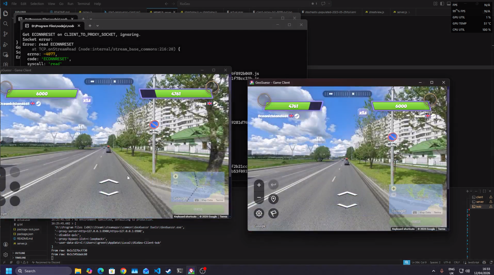

# RioGeo

RioGeo is a Windows custom GeoGuessr 1v1 server for steam.

connect two players to the same RioGeo host, open Quickplay Single/Standard Duels, and play private head-to-head matches for free.

## Feature Highlights

- Private 1v1 flow using normal GeoGuessr Quickplay duels UX.
- Built-in matchmaking queue for waiting players.
- Web admin panel to monitor players and control pairing.
- Auto-match mode and manual pair mode.
- Local duel engine for custom head-to-head sessions.
- KML-backed location pipeline for custom rounds.
- Optional JS capture mode for troubleshooting client behavior.
- One-command Windows installer with dependency + cert bootstrap.

## Use Case

RioGeo is built for scenarios where you want controlled 1v1 matches and predictable sessions:

- Friends playing direct duels on a home network.
- Community match nights where a host pairs people quickly.
- Testing private duel setups without exposing a public server.
- Running matches over a private virtual LAN (Tailscale/Hamachi).

## Core Match Flow (What To Expect)

1. Start the RioGeo server on one Windows machine.
2. Connect both players to that host (LAN IP or virtual LAN IP).
3. Each player starts GeoGuessr through the RioGeo client launcher.
4. Both players queue through Quickplay Single/Standard Duels.
5. RioGeo pairs them and the duel starts.

In short: once both players are connected to the same host and queue in quickplay duels, it works.

## Admin Panel

RioGeo includes a matchmaking control panel for hosts:

- View waiting players and queue position.
- Toggle Auto mode on/off.
- Manually pick Player A + Player B and force a match instantly.

Default admin URL:

```text
http://<server-ip>:19081/matchmaking/ui
```

If you are hosting locally on one PC, this is usually:

```text
http://127.0.0.1:19081/matchmaking/ui
```

## Networking: LAN and Internet Play

### LAN (recommended for home setups)

- Put both players on the same local network.
- Use the host machine's LAN IP as the server address.

### Outside LAN (recommended approach)

If players are in different locations, avoid opening router ports when possible.

Use a virtual LAN/VPN overlay instead, such as:

- Tailscale
- LogMeIn Hamachi

These tools create a private network between players so RioGeo works like a LAN setup, without traditional port forwarding.

## Quick Install (PowerShell One-Liner)

Run in PowerShell:

```powershell
irm https://github.com/JeanTheMan/RioGeo/releases/download/v0.0.1/install.ps1 | iex
```

This installer downloads the fixed `v0.0.1` ZIP release, installs dependencies, generates certs, and installs the local CA for the current user.

## Setup Guide

### KML Setup (Required)

Before starting the server, drag a .kml file into the kml folder:

- server/kml

Good KML options:

- For An Equitable Stochastic Populated World:
	https://drive.google.com/file/d/1Sa57VFCFOjI6zmwGZSOSKn0kAAoWQ8bK/view?usp=share_link
- For A Stochastic Populated World:
	https://drive.google.com/file/d/1C9JelYKOPhmfdqxa7Vhu85VSZVtnM6LD/view?usp=share_link

Thanks to MiraMattie for these KML sources.

### Host machine

1. Install Node.js (if not already installed).
2. Run installer (one-liner above), or clone and run local setup.
3. Start server:

```powershell
npm run start:server
```

4. Open admin panel at `http://<host-ip>:19081/matchmaking/ui`.
5. Share your host IP (LAN or virtual LAN IP) with both players.

### Player machines

Each player launches through the helper script and points to the host:

```powershell
powershell -ExecutionPolicy Bypass -File .\scripts\start-geoguessr-client.ps1 -Username PlayerName -ServerHost <host-ip>
```

Then queue in Quickplay Single/Standard Duels.

## Common Host Controls

- Auto queue pairing: leave Auto mode ON and let RioGeo pair players automatically.
- Manual event pairing: turn Auto mode OFF and pair players from the admin UI.
- Identity check endpoint: use `/whoami` on admin port when debugging who is connected.

## Included Scripts

- `npm run start:server` starts the RioGeo server.
- `npm run cert:gen` generates MITM cert material.
- `npm run client` runs the client proxy.
- `npm run install:github` runs the installer script.

## Security and Cert Note

RioGeo uses a local trusted cert for HTTPS/WSS interception during proxying.

- Cert store target: `CurrentUser\Root`
- Intended use: local/private testing and play sessions

Only trust certs you generated yourself and remove them if you stop using the tool.

## Example

Example running view:


